  

---

### 📈 Live Competitive Programming Stats

  
  &nbsp;
  

  
  &nbsp;
  

---

### 👨‍💻 About Me

- 🎓 **Education**: Pursuing B.Tech in Information Technology at **Indian Institute of Information Technology (IIIT) Bhopal**.
- 🚀 **Focus Areas**: Machine Learning,Deep Learning, Data Science, Data Structures & Algorithms, Competitive Programming.
- 💡 **Core Strengths**: Analytical Problem Solving, Algorithmic Optimization, Exploratory Data Analysis, Predictive Modeling.
- 🎯 **Current Goals**: Advanced Machine Learning Architectures, Competitive Programming Rankings, and Open-Source Contributions.
- 💬 **Ask me about**: Python, C++, Machine Learning algorithms, Scikit-learn, and DSA strategies.
- 📫 **Reach me at**: `muditagrawal06@gmail.com`

---

### 🛠️ Tech Stack & Skills

#### 💻 Programming Languages & Core

  
  
  
  
  

#### 🤖 Machine Learning & Data Science

  
  
  
  
  
  

#### ⚙️ Developer Tools & AI Technologies

  
  
  
  
  

---

### 📊 GitHub Metrics

  
  

  

  

---

### 📬 Connect & Collaborate

  
  &nbsp;&nbsp;
  
  &nbsp;&nbsp;
  
  &nbsp;&nbsp;
  

  
  &nbsp;
  

  Designed &amp; Crafted with ❤️ by <a href="https://github.com/mudit-1711">Mudit Agrawal</a>

